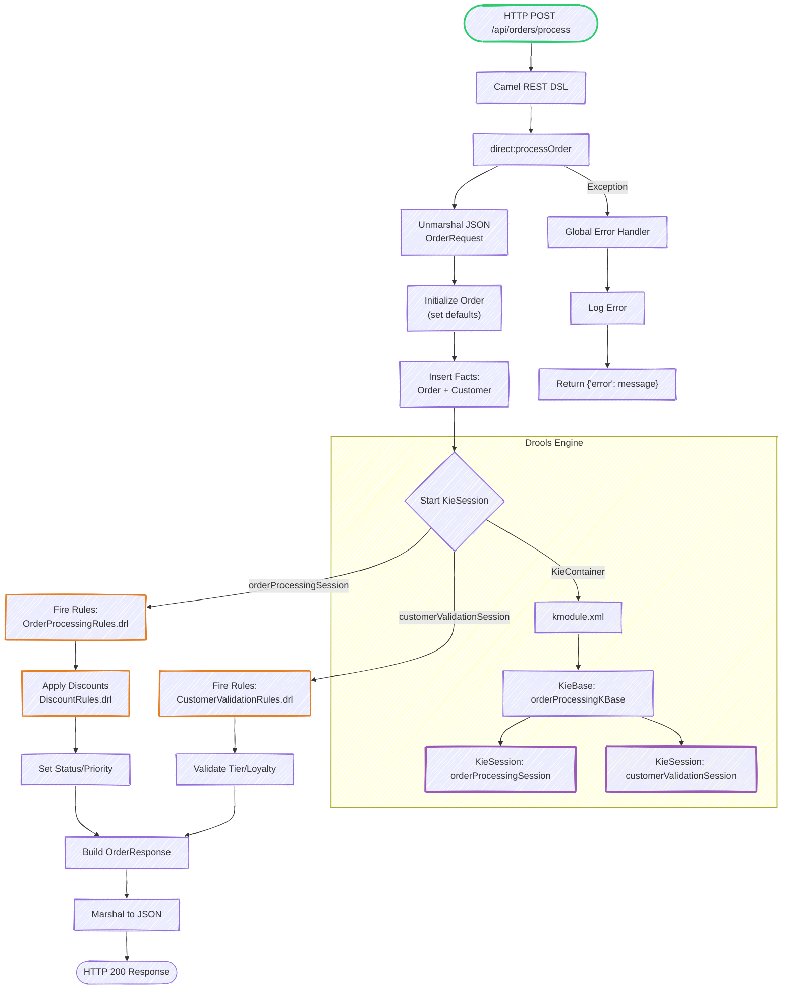

# **Order Processing System with Apache Camel & Drools**  
*A Hybrid Integration Platform with Rule-Based Processing*

---

## **📌 Overview**  
This system combines:  
✅ **Apache Camel** (for intelligent routing)  
✅ **Drools** (for dynamic business rules)  
✅ **Spring Boot** (for REST APIs)  

Key workflows:  
1. **REST API processing** with JSON validation  
2. **File-based batch processing**  
3. **Rule-driven order/customer validation**  

---

## **🚀 Key Advantages of Camel over Traditional MVC**  

| **Feature**               | **Camel Implementation**                          | **Traditional MVC**                     |  
|---------------------------|--------------------------------------------------|----------------------------------------|  
| **Routing Logic**          | Declarative (Java/XML DSL)                       | Imperative (Controller methods)        |  
| **Protocol Support**       | 300+ components (HTTP, FTP, JMS, Kafka, etc.)    | Limited to HTTP                        |  
| **Error Handling**         | Global/route-specific error handlers             | Manual `@ExceptionHandler`             |  
| **Data Transformation**    | Built-in (JSON/XML/CSV converters)               | Manual `ObjectMapper` usage            |  
| **Monitoring**            | JMX/Camel Console                                | Requires Spring Actuator               |  
| **File Processing**       | Native file watchers + filters                   | Manual file polling                    |  
| **Transaction Support**   | End-to-end transactional routes                 | Manual `@Transactional`               |  

---

## **🔗 All Routes (REST + Camel)**  

### **1. REST API Routes (Spring Boot)**  
| Endpoint                     | Method | Description                          |  
|------------------------------|--------|--------------------------------------|  
| `/api/orders/process`        | POST   | Submit order for processing          |  
| `/api/orders/sample`         | GET    | Get sample order payload             |  
| `/api/test/health`           | GET    | System health check                  |  
| `/api/test/simple`           | GET    | Test order with direct service call  |  
| `/api/test/full-order`       | POST   | Test endpoint for full order flow    |  

---

### **2. Camel Routes (Integration Flows)**  

#### **🔹 OrderProcessingRoute** *(Primary Route)*  
```java
from("direct:processOrder")
  .unmarshal().json(OrderRequest.class)           // JSON → Java
  .bean(OrderProcessingService, "validateCustomer") // Drools Session
  .bean(OrderProcessingService, "processOrder")    // Drools Session
  .marshal().json()                                // Java → JSON
  .to("log:processed?level=INFO")
```

#### **🔹 File Processing Route**  
```java
from("file:input/orders?noop=true")              // Auto-file-watching
  .unmarshal().json(OrderRequest.class)           // File → Java
  .to("direct:processOrder")                     // Reuse main flow
  .marshal().json()
  .to("file:output/processed-orders")             // Save processed
```

#### **🔹 SimpleOrderRoute** *(Testing/Debugging)*  
```java
rest("/api/simple")
  .get("/test").to("direct:simpleTest")           // Quick health check
  .post("/order").to("direct:processSimpleOrder") // Minimal order flow
```

#### **🔹 Error Handling Route** *(Global)*  
```java
onException(Exception.class)
  .handled(true)
  .log("Error: ${exception.message}")
  .setBody().constant("{\"error\": \"Processing failed\"}")
  .setHeader(Exchange.CONTENT_TYPE, "application/json");
```

---

## **⚙️ Drools Integration**  
**Rule Sessions Configured in `kmodule.xml`:**  
```xml
<ksession name="orderProcessingSession" type="stateful"/> <!-- Order rules -->  
<ksession name="customerValidationSession" type="stateful"/> <!-- Validation -->  
```

**Key Rule Files:**  
- `OrderProcessingRules.drl` → Discounts/priorities  
- `DiscountRules.drl` → Loyalty-based logic  
- `CustomerValidationRules.drl` → Tier validation  

---

## **📊 Workflow Diagram**  


---

## **🛠️ How to Run**  
```bash
mvn spring-boot:run
```
**Test with:**  
```bash
curl -X POST http://localhost:8080/api/orders/process -H "Content-Type: application/json" -d @sample-order.json
```

---

## **🌟 Why This Architecture Wins**  
1. **Agility**: Change business rules (Drools) without redeploying code.  
2. **Extensibility**: Add new routes (Kafka/SFTP) without disrupting existing flows.  
3. **Observability**: Built-in Camel metrics + logging.  
4. **Consistency**: Reuse the same rules across REST/files/queues.  

---

## **📈 Future Improvements**  
- Add **Kafka integration** for event streaming  
- Implement **Swagger UI** for API docs  
- Extend rules with **fraud detection**  

---

**🎯 Perfect for:** E-commerce order pipelines, loan processing, dynamic pricing systems.  

``` 
Made with ❤️ using Camel + Drools + Spring Boot
```
